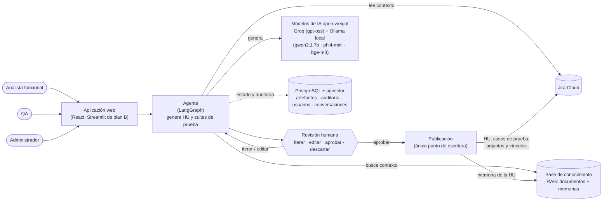

# Bienvenida al proyecto · Agente de IA de Análisis Funcional y QA

*Estado a 8 de octubre de 2026.* Este documento te sitúa: qué hace el agente, cómo está construido, cómo trabajamos y en qué punto estamos. El detalle técnico está en los documentos de referencia que se citan al final.

## 1. Qué es
Un agente que **redacta y evoluciona Historias de Usuario (HU) y artefactos de QA** (casos de prueba, Gherkin, matriz de cobertura, estrategia) a partir de **Jira Cloud** y de una **base de conocimiento (RAG)** con la documentación funcional. Funciona así:
- La IA propone y la persona revisa, itera, edita y aprueba.
- **Solo lo aprobado se publica en Jira.**
- Cada HU publicada genera una **memoria** `.md`, que vuelve al RAG y mejora las siguientes propuestas.

Tiene cuatro flujos, según el rol:

| Flujo | Rol | Qué hace |
|---|---|---|
| Nueva necesidad | Analista funcional | De un texto libre a una HU nueva |
| Evolucionar una HU | Analista funcional | Versión nueva de una HU de Jira, con diff y análisis de impacto |
| Revisar la calidad | Analista funcional | Informe INVEST y hallazgos de una HU, **sin publicar** |
| Preparar pruebas | QA | Suite de casos de una HU: Gherkin, matriz, datos y estrategia |
| Memoria | Todos | Lo que el agente ha aprendido de las HU publicadas |

## 2. Arquitectura



- **Actores:** el analista funcional crea, evoluciona y revisa HU; QA genera las suites de prueba de una HU; el administrador gestiona conexiones, modelos y documentos.
- **Agente:** es un grafo de LangGraph con los nodos `load_origin → retrieve_context → generate → human_review → publish → memorize`. Reúne el contexto de Jira y del RAG, pide al modelo una **salida estructurada** (modelos pydantic de `schemas/`) y la valida antes de enseñarla: las citas solo pueden venir del contexto, se comprueba la cobertura de los CA y se buscan datos personales.
- **Revisión humana:** la persona aprueba con la **huella** (SHA-256) de la versión que vio. Si el contenido cambia, la aprobación ya no vale.
- **Publicación:** es el único nodo que escribe en Jira y exige una aprobación vigente. Por defecto trabaja en **modo simulación**: audita lo que haría y no escribe nada.
- **Modelos:** desde el 8 de octubre, configuración **mixta** (PA-443): Groq, en su nivel gratuito, para HU, evolución, calidad, impacto y memoria (segundos); Ollama local para QA (minutos en CPU) y como respaldo de todo. Todos son open-weight y gratuitos (D-14). `config/README.md` explica cómo pasar a todo local.

Diagrama C4 más detallado: `docs/arquitectura-c4.md`. Contratos, nodos y tablas: `docs/specs/SPEC-00-fundacional.md`.

## 3. Principios no negociables (resumen de `CLAUDE.md`)
1. **Aprobación humana:** nada se escribe en Jira salvo `publish`, y solo con una aprobación vigente.
2. **Secretos:** nunca en el código, las pruebas, los prompts, los logs ni la documentación. Se leen solo vía `core/config.py` desde `.env`.
3. **Datos sintéticos:** nada de nombres, emails ni DNI reales.
4. **Trazabilidad:** todo artefacto referencia su origen (clave de Jira e IDs de CA, RN y CP).
5. **Salidas estructuradas:** el LLM devuelve modelos de `schemas/`, no texto libre.
6. **Sin alcance extra:** una mejora no pedida se anota como propuesta (`PA-XX`) en el Kanban y no se implementa.

## 4. Stack y mapa del repositorio
Python 3.12 · uv · LangGraph · FastAPI · SDK de OpenAI (proveedores compatibles: Groq y Ollama) · PostgreSQL + pgvector · Alembic · React + TypeScript + Vite · Streamlit (plan B) · httpx · pydantic v2 · structlog · Langfuse · pytest · Vitest · ruff · Docker Compose.

| Carpeta | Contenido |
|---|---|
| `schemas/` | Modelos de dominio: HU, suite de pruebas, impacto, memoria, informe de calidad |
| `adapters/` | Jira (lectura y escritura, ADF), casos de prueba en Jira, LLM, embeddings, pgvector, usuarios. `base.py` tiene los `Protocol` |
| `core/` | Grafo, contexto, aprobaciones, auditoría, proyectos, conversaciones, arranque guiado, revisión de calidad y composición (`container.py`, `factories.py`) |
| `prompts/` | Un prompt por tarea, con cabecera `version:` |
| `api/` | API HTTP (FastAPI) para la web; contrato en `docs/api/openapi.yaml` |
| `web/` | La web en React («Propuesta mixta», `docs/specs/UI.md`), interfaz principal |
| `app/` | La UI en Streamlit, plan B |
| `mcp_server/` | Servidor MCP de solo lectura (Claude Desktop, Claude Code, VS Code) |
| `data/seed/` | Corpus sintético del RAG (biblioteca de Villaficticia) y seed de Jira importable por CSV |
| `eval/` | Evaluación de la recuperación y medición de tokens de la memoria |
| `tests/` | `unit/` (con los fakes de `tests/fakes/`, sin servicios) e `integration/` (servicios reales, se saltan sin credenciales) |
| `docs/` | SPEC, decisiones, Kanban, UI, arquitectura y prompts de las sesiones |

## 5. Cómo trabajamos
- **Ramas:** `PreProduccion` es la rama de integración y nunca se fusiona directamente en `main`. El trabajo en paralelo va en **ramas propias** creadas desde `PreProduccion`. Una sesión principal revisa cada rama, ejecuta las pruebas sobre la fusión y la integra.
- **Sesiones de Claude Code en paralelo:** cada línea de trabajo es una sesión con su worktree, su rama, sus carpetas y su prompt de arranque en `docs/prompts/SESION-*.md`. Ahora mismo hay estas:
  - **principal**: integración, contratos y la presentación;
  - **Jira** (`area-a`), **Modelos** (`area-b`), **Seguridad** (`ses-seguridad`) y **UI** (`ses-ui`): una ronda cada una con lo que encontró la auditoría del 2026-10-08 (`docs/auditorias/`).
- **Kanban (`docs/KANBAN.md`):**
  - Cada tarea `T-XX` tiene su sesión, sus dependencias y su trazabilidad (RF, RNF, D).
  - Estados: ⬜ → 🔄 → 👀 → ✅.
  - Cada sesión cambia solo **sus filas** y añade **su fila** al registro diario.
  - Las propuestas `PA-XX` se numeran por rangos, para no pisarse.
- **Flujo de una tarea (skill `/tarea T-XX`):**
  1. leer la tarea y la SPEC;
  2. marcar 🔄;
  3. presentar un plan y **esperar confirmación**;
  4. implementar solo su alcance;
  5. pruebas con el subagente `test-writer`;
  6. `pytest` y `ruff` en verde;
  7. subagentes `spec-checker` (CONFORME) y `security-reviewer` (APTO);
  8. marcar ✅;
  9. commit `T-XX: descripción [RF-YY]`.
- **Contratos congelados:** `schemas/`, `adapters/base.py`, `adapters/errors.py`, `core/config.py` y `core/container.py` solo los cambia la sesión principal. Si necesitas cambiarlos, se propone.

## 6. Dónde estamos (8 de octubre de 2026)
**Hecho y fusionado** en `PreProduccion` (unas 7200 pruebas de Python y 2580 de la web, en verde):
- **Los flujos completos:** nueva necesidad, evolucionar con diff e impacto, revisar la calidad (INVEST), preparar pruebas con cobertura validada, registrar la ejecución (T-47), pasar una HU a QA (T-54) y memoria tras publicar.
- **La web en React (T-56, entregada)** sobre la API HTTP (T-55); Streamlit queda como plan B. Accesible (WCAG 2.1 A/AA revisada con axe) y con el logo completo de Qaracter en el login.
- **Jira real:** publicación validada en el proyecto sintético **AFQP**, que admite `JIRA_PUBLISH_MODE=live` (siempre con aprobación).
- **Modelos mixtos** Groq + Ollama, con espera ante el límite por minuto y respaldo local (PA-443); medidas en `docs/pruebas/medidas-groq-vs-local-2026-10-07.md`.
- **Observabilidad:** trazas en Langfuse Cloud. **MCP** de solo lectura.
- **Auditoría completa** del repositorio (`docs/auditorias/AUDITORIA-2026-10-08.md`): sin escrituras en Jira sin aprobación; 1 hallazgo alto y 11 medios, repartidos en las sesiones (PA-450…PA-461).

**Siguiente:** la presentación a dirección y la demo (T-36).

## 7. Puesta en marcha
**Para el backend** (y para ejecutar la app completa) hace falta poder ejecutar Python, `uv` y Docker. **Para el frontend en React basta Node.js** y la API simulada (§8).

```bash
git clone <repositorio> && cd agente-af-qa
git switch PreProduccion
uv sync
cp .env.example .env                      # pide los valores al responsable del proyecto; nunca se versiona
docker compose --profile local-llm up -d db ollama
docker compose exec ollama ollama pull qwen3:1.7b
docker compose exec ollama ollama pull phi4-mini
docker compose exec ollama ollama pull bge-m3
uv run alembic upgrade head
uv run pytest -m "not integration"        # debe salir en verde
uv run python -m core.rag.indexing        # indexa el corpus sintético (solo embeddings, sin LLM)
uv run python -m core.seed_users          # usuarios de demo; las contraseñas se muestran una sola vez
uv run python -m api                      # API en el puerto 8000
cd web && npm ci && npm run dev           # web en http://localhost:5173 (otra terminal)
```

El arranque diario, ya instalado, está en el `README.md`.

## 8. Histórico: el rol de responsable del frontend (área B)

> Plan de la ronda de T-56, que se entregó el 2026-10-08 (PR #2 a #18). Se conserva como referencia.

### Rol original: responsable de producto y frontend (área B)
No entras como una línea más: **eres el dueño del área B, «Conocimiento y UI»**, y tu entrega principal hasta la demo es **el frontend propio en React (T-56)**. Tiene que verse como el lienzo «Propuesta mixta» (decisión del 2 de octubre: D-04 revisada).

### Qué es tuyo
| Ámbito | Carpetas |
|---|---|
| **Frontend en React** (T-56) | `web/` (nuevo), `docs/specs/UI.md`, `docs/diseno/` |
| **Conocimiento (RAG)**, cuando tengas Python | `adapters/embeddings/`, `adapters/vectorstore/`, `core/rag/`, `data/seed/corpus/` |
| **Generación funcional, QA y memoria**, cuando tengas Python | `core/functional/`, `core/qa/`, `core/memory/` |
| **Evaluación** | `eval/` |
| **Prompts** | `prompts/`, compartida: avisa a la principal antes de cambiar un prompt que use el grafo |

**La UI en Streamlit (`app/`)** queda como **plan B**: la sigue una sesión de Claude Code (`ses-ui`, con T-31, revisar la calidad, T-28 y Memoria) hasta el punto de control **T-57**, en el que se decide con qué se hace la demo. Tú la supervisas como responsable de la UI.

### Qué sigue siendo de la sesión principal
- **Contratos:** `schemas/`, `adapters/base.py`, `adapters/errors.py`, `core/config.py`, `core/container.py`, `core/factories.py` y la SPEC.
- **El grafo** (`core/graph/`), las aprobaciones y la auditoría.
- **Jira:** el adaptador, `adapters/testmgmt/` y el modo `live`.
- **El LLM** (`adapters/llm/`).
- **La API HTTP para tu frontend (T-55):** el contrato OpenAPI y la API simulada primero, y después la API real.
- **El flujo unido HU → QA (T-54).**
- **La integración final en `PreProduccion`.**

Si necesitas un cambio en el contrato de la API, lo propones con una `PA` y la principal lo incorpora.

### Entorno: empiezas sin Python ni Docker
- **Para el frontend te basta con Node.js (LTS) y Git.** Trabajas contra la **API simulada** que genera el contrato `docs/api/openapi.yaml` (T-55, lo deja la principal el primer día).
- Hasta que esté el contrato, empieza por el **sistema de diseño**: colores, tipografía DM Sans, el carril, la barra de conversaciones, la Q animada y los estados. Todo está en `docs/diseno/lienzo/project/*.dc.html` y en el lienzo (https://claude.ai/artifact/PK7Mfx3z357t1x7e2hsSbB, página «Propuesta mixta»).
- **Python, `uv` y Docker** te harán falta para la integración con la API real y para el resto del área B. Mientras tanto, la principal ejecuta las pruebas de la integración.

### Cómo trabajas
- **Rama:** la tuya es `area-b`, ya creada en GitHub desde `PreProduccion`, con una **PR en borrador `area-b → PreProduccion`** donde vas subiendo el frontend y la principal lo revisa.
- **Tus sesiones de Claude Code:** las diriges tú, con el flujo `/tarea` y los revisores (`spec-checker` y `security-reviewer`). Tu prompt de arranque es `docs/prompts/RESPONSABLE-AREA-B.md`.
- **Pruebas del frontend:** Vitest y Testing Library para los componentes, y un `lint` y un `build` sin errores antes de cada entrega.
- **Entregas:** `git push origin area-b` y avisas. La principal valida la fusión e integra.
- **Kanban:**
  - mueves tus tareas;
  - añades tu fila al registro diario;
  - tus propuestas se numeran **PA-300…PA-399**.
- **Ritmo:** una sincronización diaria con la principal.

### Plan de la ronda (≈10 días)
| Días | Tú (React) | Principal |
|---|---|---|
| 1 | Proyecto `web/` (Vite, React y TypeScript), sistema de diseño, carril y barra de conversaciones | Contrato `docs/api/openapi.yaml` y API simulada |
| 2–4 | Inicio, Elegir en Jira, Origen y fuentes, Generando, Iterar con la propuesta, contra la API simulada | Flujo unido HU → QA (T-54) y API real (T-55) |
| **5** | **Punto de control T-57**: demo interna de lo hecho | **¿React o Streamlit para la demo?** |
| 6–8 | Recibo y resultado, revisar la calidad, flujo de QA (con «Preparar pruebas» desde la HU aprobada) e integración con la API real | API real, seguridad (sesión, CORS) y pruebas sobre la fusión |
| 9–10 | Pulido, accesibilidad y ensayo de la demo | Ensayo de la demo y `v1.0` (T-36) |

## 9. Documentos de referencia
| Documento | Para qué |
|---|---|
| `CLAUDE.md` | Reglas de trabajo, áreas y convenciones (lo leen todas las sesiones) |
| `docs/specs/SPEC-00-fundacional.md` | **Fuente de verdad:** contratos, grafo, tablas, configuración y anexo §11 con cada decisión de implementación |
| `docs/specs/UI.md` | Pantallas, roles, contrato de aprobación y errores de la UI |
| `docs/decisiones/01_declaraciones_proyecto.md` | Requisitos RF/RNF, decisiones D-XX y revisiones R-XX |
| `docs/KANBAN.md` | Tareas, decisiones por día, propuestas y registro diario |
| `docs/arquitectura.md`, `docs/arquitectura-c4.md` | Diagramas de arquitectura |
| `docs/prompts/SESION-*.md` | Prompts de arranque de las sesiones en paralelo |
| `docs/prompts/RESPONSABLE-AREA-B.md` | Tu prompt de arranque como responsable del área B |
| `docs/diseno/lienzo/` | Las pantallas del lienzo «Propuesta mixta» (HTML y CSS de referencia para React) |
| `docs/api/openapi.yaml` | Contrato de la API para el frontend (T-55) |
