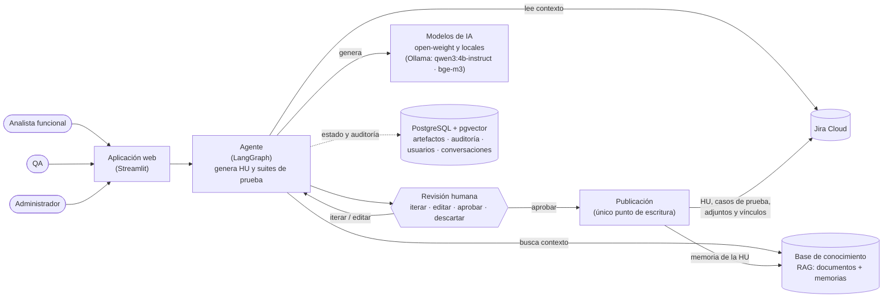

# Bienvenida al proyecto · Agente de IA de Análisis Funcional y QA

*Estado a 2 de octubre de 2026.* Este documento te sitúa: qué hace el agente, cómo está construido, cómo trabajamos y en qué punto estamos. El detalle técnico está en los documentos de referencia que se citan al final.

## 1. Qué es
Un agente que **redacta y evoluciona Historias de Usuario (HU) y artefactos de QA** (casos de prueba, Gherkin, matriz de cobertura, estrategia) a partir de **Jira Cloud** y de una **base de conocimiento (RAG)** con la documentación funcional. Funciona así:
- La IA propone y la persona revisa, itera, edita y aprueba.
- **Solo lo aprobado se publica en Jira.**
- Cada HU publicada genera una **memoria** `.md`, que vuelve al RAG y mejora las siguientes propuestas.

Tiene cuatro flujos, según el rol:

| Flujo | Rol | Qué hace |
|---|---|---|
| Nueva necesidad | Analista funcional | De un texto libre a una HU nueva |
| Evolucionar una HU | Analista funcional | Versión nueva de una HU de Jira, con diff y análisis de impacto |
| Revisar la calidad | Analista funcional | Informe INVEST y hallazgos de una HU, **sin publicar** |
| Preparar pruebas | QA | Suite de casos de una HU: Gherkin, matriz, datos y estrategia |

## 2. Arquitectura



- **Actores:** el analista funcional crea, evoluciona y revisa HU; QA genera las suites de prueba de una HU; el administrador gestiona conexiones, modelos y documentos.
- **Agente:** es un grafo de LangGraph con los nodos `load_origin → retrieve_context → generate → human_review → publish → memorize`. Reúne el contexto de Jira y del RAG, pide al modelo una **salida estructurada** (modelos pydantic de `schemas/`) y la valida antes de enseñarla: las citas solo pueden venir del contexto, se comprueba la cobertura de los CA y se buscan datos personales.
- **Revisión humana:** la persona aprueba con la **huella** (SHA-256) de la versión que vio. Si el contenido cambia, la aprobación ya no vale.
- **Publicación:** es el único nodo que escribe en Jira y exige una aprobación vigente. Por defecto trabaja en **modo simulación**: audita lo que haría y no escribe nada.
- **Modelos:** desde el 1 de octubre, **solo modelos locales de Ollama** (sin cuota ni coste). En CPU son lentos: una HU completa puede tardar varios minutos.

Diagrama C4 más detallado: `docs/arquitectura-c4.md`. Contratos, nodos y tablas: `docs/specs/SPEC-00-fundacional.md`.

## 3. Principios no negociables (resumen de `CLAUDE.md`)
1. **Aprobación humana:** nada se escribe en Jira salvo `publish`, y solo con una aprobación vigente.
2. **Secretos:** nunca en el código, las pruebas, los prompts, los logs ni la documentación. Se leen solo vía `core/config.py` desde `.env`.
3. **Datos sintéticos:** nada de nombres, emails ni DNI reales.
4. **Trazabilidad:** todo artefacto referencia su origen (clave de Jira e IDs de CA, RN y CP).
5. **Salidas estructuradas:** el LLM devuelve modelos de `schemas/`, no texto libre.
6. **Sin alcance extra:** una mejora no pedida se anota como propuesta (`PA-XX`) en el Kanban y no se implementa.

## 4. Stack y mapa del repositorio
Python 3.12 · uv · LangGraph · SDK de OpenAI (proveedores compatibles: Ollama) · PostgreSQL + pgvector · Alembic · Streamlit · httpx · pydantic v2 · structlog · pytest · ruff · Docker Compose.

| Carpeta | Contenido |
|---|---|
| `schemas/` | Modelos de dominio: HU, suite de pruebas, impacto, memoria, informe de calidad |
| `adapters/` | Jira (lectura y escritura, ADF), casos de prueba en Jira, LLM, embeddings, pgvector, usuarios. `base.py` tiene los `Protocol` |
| `core/` | Grafo, contexto, aprobaciones, auditoría, proyectos, conversaciones, arranque guiado, revisión de calidad y composición (`container.py`, `factories.py`) |
| `prompts/` | Un prompt por tarea, con cabecera `version:` |
| `app/` | La UI en Streamlit («Propuesta mixta», `docs/specs/UI.md`) |
| `data/seed/` | Corpus sintético del RAG (biblioteca de Villaficticia) y seed de Jira importable por CSV |
| `eval/` | Evaluación de la recuperación y medición de tokens de la memoria |
| `tests/` | `unit/` (con los fakes de `tests/fakes/`, sin servicios) e `integration/` (servicios reales, se saltan sin credenciales) |
| `docs/` | SPEC, decisiones, Kanban, UI, arquitectura y prompts de las sesiones |

## 5. Cómo trabajamos
- **Ramas:** `PreProduccion` es la rama de integración y nunca se fusiona directamente en `main`. El trabajo en paralelo va en **ramas propias** creadas desde `PreProduccion`. Una sesión principal revisa cada rama, ejecuta las pruebas sobre la fusión y la integra.
- **Sesiones de Claude Code en paralelo:** cada línea de trabajo es una sesión con su worktree, su rama, sus carpetas y su prompt de arranque en `docs/prompts/SESION-*.md`. Ahora mismo hay estas:
  - **principal**: integración y contratos;
  - **UI**: `ses-ui`, que pasa a ser tuya (§8);
  - **Jira**: `ses-jira`;
  - **T-32**: `ses-memoria`;
  - **Ollama**: la prueba de punta a punta.
- **Kanban (`docs/KANBAN.md`):**
  - Cada tarea `T-XX` tiene su sesión, sus dependencias y su trazabilidad (RF, RNF, D).
  - Estados: ⬜ → 🔄 → 👀 → ✅.
  - Cada sesión cambia solo **sus filas** y añade **su fila** al registro diario.
  - Las propuestas `PA-XX` se numeran por rangos, para no pisarse.
- **Flujo de una tarea (skill `/tarea T-XX`):**
  1. leer la tarea y la SPEC;
  2. marcar 🔄;
  3. presentar un plan y **esperar confirmación**;
  4. implementar solo su alcance;
  5. pruebas con el subagente `test-writer`;
  6. `pytest` y `ruff` en verde;
  7. subagentes `spec-checker` (CONFORME) y `security-reviewer` (APTO);
  8. marcar ✅;
  9. commit `T-XX: descripción [RF-YY]`.
- **Contratos congelados:** `schemas/`, `adapters/base.py`, `adapters/errors.py`, `core/config.py` y `core/container.py` solo los cambia la sesión principal. Si necesitas cambiarlos, se propone.

## 6. Dónde estamos (2 de octubre de 2026)
**Hecho y fusionado** (unas 3400 pruebas unitarias en verde):
- **Cimientos:** esquemas, configuración, migraciones, fakes, autenticación local y roles, y auditoría.
- **Jira:**
  - lectura: búsqueda JQL paginada, proyectos, épicas, HU y ADF;
  - **escritura:** crear y actualizar HU con el comentario del diff, vínculos «relates to», y casos de prueba como subtareas con adjuntos, con publicación parcial e idempotente.
- **RAG:** ingesta, fragmentación, embeddings `bge-m3`, búsqueda híbrida y 7 categorías. Recall@6 0,90 y MRR 0,95.
- **Agente:**
  - HU nueva, evolución con diff e impacto, modo QA con cobertura validada y memoria tras publicar;
  - revisión humana con huella, edición manual y decisiones `iterate`/`edit`/`approve`/`discard`;
  - publicación en simulación.
- **Backend de la UI:**
  - proyecto por conversación;
  - conversaciones persistentes en PostgreSQL, con control del dueño;
  - arranque guiado sin IA (claves en el texto y HU parecida);
  - revisión de calidad (INVEST).
- **UI:** login, inicio, elegir en Jira, origen y fuentes, generación, iteración, edición y lista de conversaciones.

**En curso:**
- **UI:** T-31 (recibo de aprobación y resultado), pantalla de revisar la calidad, T-28 (pantallas de QA) y pestaña Memoria.
- **Jira:** validar la escritura real en el sandbox y después T-47 (registro de la ejecución de los casos).
- **T-32:** contador de tokens y endurecimiento de reintentos, errores y logs del LLM.
- **Ollama:** la **primera prueba real de punta a punta** con modelos locales. Midiendo tiempos: una llamada mínima tarda unos 22 s en frío.

**Pendiente:**
- `JIRA_PUBLISH_MODE=live`, que está bloqueado hasta validar la escritura;
- T-29 (administración);
- las pruebas cruzadas (T-34 y T-35);
- el README y la demo `v1.0` (T-36);
- la v1.1: T-39 a T-46 (Langfuse, lenguaje natural a JQL, ingesta automática, evaluación ampliada…).

## 7. Puesta en marcha
**Requisito imprescindible:** poder ejecutar Python, `uv` y Docker en tu equipo. Sin pruebas ni `ruff` no se puede cerrar ninguna tarea.

```bash
git clone <repositorio> && cd agente-af-qa
git switch PreProduccion
uv sync
cp .env.example .env                      # pide los valores al responsable del proyecto; nunca se versiona
docker compose --profile local-llm up -d db ollama
docker compose exec ollama ollama pull bge-m3
docker compose exec ollama ollama pull qwen3:4b-instruct
uv run alembic upgrade head
uv run pytest -m "not integration"        # debe salir en verde
uv run python -m core.rag.indexing        # indexa el corpus sintético (solo embeddings, sin LLM)
uv run python -m core.seed_users          # usuarios de demo; las contraseñas se muestran una sola vez
uv run streamlit run app/main.py
```

## 8. Tu rol: responsable de producto y UI (área B)
No entras como una línea más: **eres el dueño del área B, «Conocimiento y UI»**, la parte con más trabajo pendiente hasta la demo `v1.0`. Decides y entregas lo de tu área sin pedir permiso. La sesión principal mantiene el núcleo y los contratos, e integra.

### Qué es tuyo
| Ámbito | Carpetas |
|---|---|
| **UI completa** («Propuesta mixta») | `app/`, `.streamlit/`, `docs/specs/UI.md`, `tests/unit/test_app_*.py` |
| **Conocimiento (RAG)** | `adapters/embeddings/`, `adapters/vectorstore/`, `core/rag/`, `data/seed/corpus/` |
| **Generación funcional, QA y memoria** | `core/functional/`, `core/qa/`, `core/memory/` |
| **Evaluación** | `eval/` |
| **Prompts** | `prompts/`, compartida: avisa a la principal antes de cambiar un prompt que use el grafo |

**Tareas del Kanban a tu cargo:**
- T-31 (recibo de aprobación y resultado);
- la pantalla de revisar la calidad (parte de UI de T-48);
- T-28 (pantallas de QA);
- la pestaña Memoria (cierre de T-33);
- T-29 (Administración);
- PA-70 y T-44 (evaluación);
- y, en la v1.1, T-42, T-43 y T-45.

### Qué sigue siendo de la sesión principal
- **Contratos:** `schemas/`, `adapters/base.py`, `adapters/errors.py`, `core/config.py`, `core/container.py`, `core/factories.py` y la SPEC.
- **El grafo** (`core/graph/`), las aprobaciones y la auditoría.
- **Jira:** el adaptador, `adapters/testmgmt/` y el modo `live`.
- **El LLM** (`adapters/llm/`, T-32).
- **La integración final en `PreProduccion`.**

Si necesitas un cambio ahí, lo propones con una `PA` y una descripción del cambio, y la principal lo hace o lo autoriza.

### Cómo trabajas
- **Rama:** la tuya es `area-b`, creada desde `PreProduccion`. Dentro, puedes tener ramas o worktrees por tarea si te sirve.
- **Tus sesiones de Claude Code:** diriges tus propias sesiones con el flujo `/tarea` y los subagentes `test-writer`, `spec-checker` y `security-reviewer`. Tu prompt de arranque es `docs/prompts/RESPONSABLE-AREA-B.md`.
  - La sesión UI que hay ahora (`ses-ui`) **pasa a ser tuya**: recógela en el punto en que esté.
- **Tú haces la primera revisión de tu área**, con las pruebas y los dos revisores. Cuando una entrega está lista, haces `git push origin area-b` y avisas; la principal solo valida la fusión con `PreProduccion` (pruebas sobre la fusión) e integra.
- **Kanban:**
  - mueves el estado de tus tareas;
  - añades tu fila al registro diario;
  - tus propuestas se numeran **PA-300…PA-399**;
  - el tablero resumen lo actualiza la principal al integrar.
- **Ritmo:** una sincronización diaria con la principal. Repasáis lo entregado, lo bloqueado y los cambios de contrato que necesites.

### Primeros pasos
1. **Días 1 y 2 · arranque:** entorno con las pruebas en verde (§7), una demo de la app con los modelos locales y lectura de `CLAUDE.md`, la SPEC (anexo §11) y `docs/specs/UI.md`.
2. **Día 3 · recoger la UI:** revisa lo que haya entregado `ses-ui` (T-31 o lo que lleve) y sigue en este orden:
   1. T-31;
   2. la pantalla de revisar la calidad;
   3. T-28;
   4. la pestaña Memoria;
   5. T-29.
3. **En paralelo, cuando tengas hueco:** PA-70 y T-44 (evaluación), y las propuestas de tu área en el Kanban (PA-150…PA-199 de la sesión UI y PA-250…PA-299 de memoria).
4. **Hacia la `v1.0`:** con la UI cerrada, prepara con la principal la demo (T-36) y la prueba cruzada del área A (T-35).

## 9. Documentos de referencia
| Documento | Para qué |
|---|---|
| `CLAUDE.md` | Reglas de trabajo, áreas y convenciones (lo leen todas las sesiones) |
| `docs/specs/SPEC-00-fundacional.md` | **Fuente de verdad:** contratos, grafo, tablas, configuración y anexo §11 con cada decisión de implementación |
| `docs/specs/UI.md` | Pantallas, roles, contrato de aprobación y errores de la UI |
| `docs/decisiones/01_declaraciones_proyecto.md` | Requisitos RF/RNF, decisiones D-XX y revisiones R-XX |
| `docs/KANBAN.md` | Tareas, decisiones por día, propuestas y registro diario |
| `docs/arquitectura.md`, `docs/arquitectura-c4.md` | Diagramas de arquitectura |
| `docs/prompts/SESION-*.md` | Prompts de arranque de las sesiones en paralelo |
| `docs/prompts/RESPONSABLE-AREA-B.md` | Tu prompt de arranque como responsable del área B |
