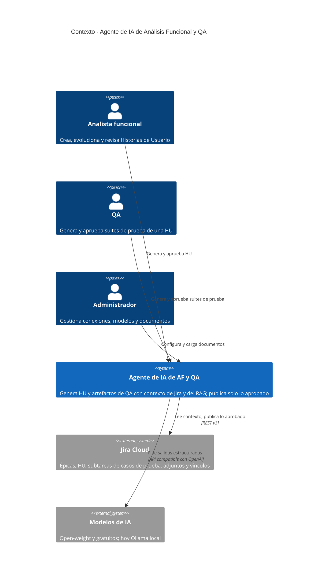
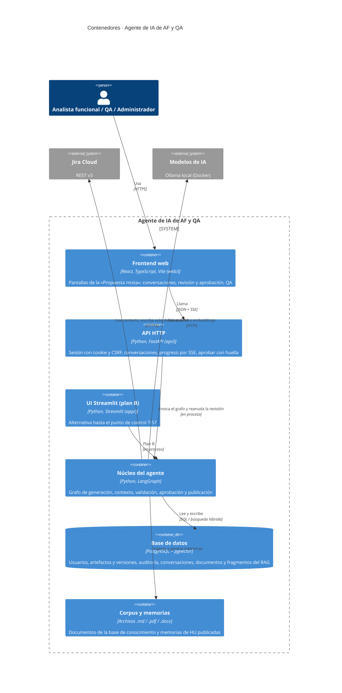
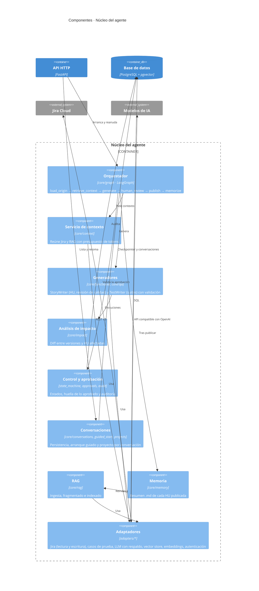

# Modelo C4 · Agente de IA de AF y QA

Modelo C4 en tres niveles (contexto, contenedores y componentes), estado a 2026-10-02 tras la D-04 revisada. La fuente de verdad sigue siendo `docs/specs/SPEC-00-fundacional.md`; el contrato de la API está en `docs/api/openapi.yaml`. La vista simplificada está en `docs/arquitectura.md`.

## Nivel 1 · Contexto del sistema

## Nivel 2 · Contenedores

La API y el núcleo se ejecutan en el mismo proceso de Python; se separan aquí porque tienen responsabilidades distintas. El frontend nunca habla con Jira ni con el LLM: solo con la API. PostgreSQL y Ollama se levantan con Docker Compose.

## Nivel 3 · Componentes del núcleo del agente

El núcleo depende solo de los protocolos de `adapters/base.py`; qué implementación se usa se decide en `core/container.py` y `core/factories.py`.
