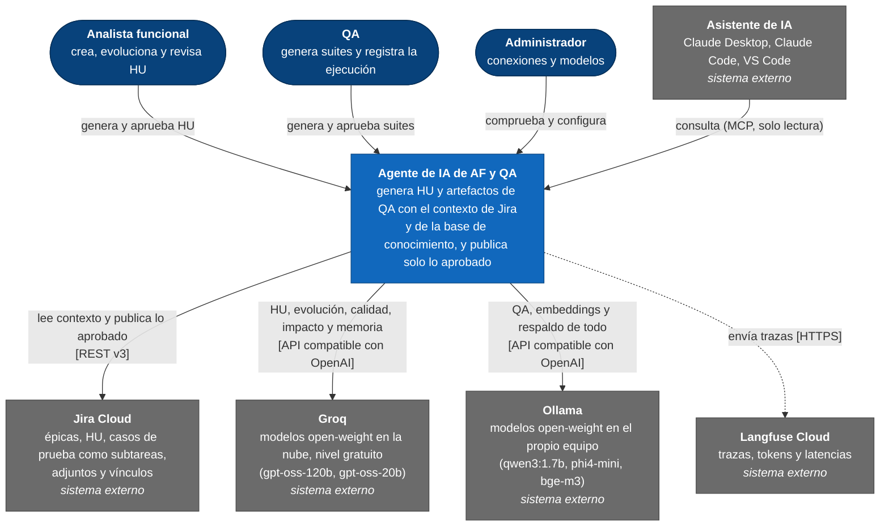
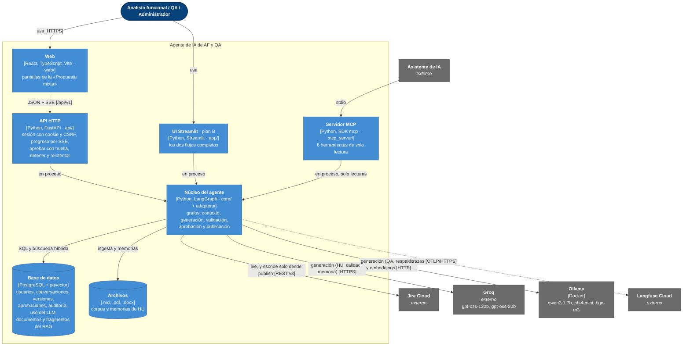
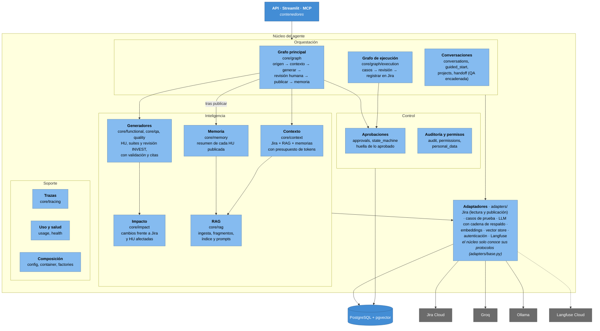

# Modelo C4 · Agente de IA de AF y QA

Modelo C4 en tres niveles, más una vista dinámica (estado a 2026-10-08). La vista simple para explicarlo está en `docs/arquitectura.md`. La fuente de verdad es `docs/specs/SPEC-00-fundacional.md`, y el contrato de la API, `docs/api/openapi.yaml`.

**Cómo leer los diagramas:** cada nivel amplía una caja del anterior. Se dibujan como diagramas de flujo con la notación y los colores de C4 (el tipo `C4` de Mermaid coloca mal las cajas).

| Color | Elemento C4 |
|---|---|
| Azul oscuro | Persona |
| Azul | Nuestro sistema o uno de sus contenedores |
| Azul claro | Componente dentro de un contenedor |
| Gris | Sistema externo |

## Nivel 1 · Contexto

Quién usa el sistema y con qué sistemas externos habla.



**Modelos (D-14, PA-443):** solo open-weight y gratuitos. La configuración por defecto es mixta; `config/models.todo-local.yaml` deja todo en Ollama y ninguna llamada sale del equipo (`config/README.md`).

## Nivel 2 · Contenedores

Qué piezas ejecutables y almacenes forman el sistema.



- **Un solo proceso de Python por entrada:** la API, Streamlit y el servidor MCP cargan el núcleo como biblioteca. Se dibujan por separado porque tienen responsabilidades distintas.
- **La web** solo habla con la API, nunca con Jira ni con los modelos.
- **El servidor MCP** envuelve Jira con un proxy que solo deja pasar lecturas.
- **Docker Compose** levanta PostgreSQL y Ollama; la API tiene además su propia imagen (perfil `full`).
- **Cadena de modelos:** cada tarea tiene un modelo principal y un respaldo. Ante un 429 de Groq se espera hasta 60 s; si la petición no cabe en su límite por minuto (413), se pasa al local sin reintentar. Los límites (ventana, presupuesto de contexto y topes de salida) son por proveedor.

## Nivel 3 · Componentes del núcleo

Qué hay dentro del contenedor «Núcleo del agente», agrupado por responsabilidad.



- **Orquestación:**
  - el grafo principal sirve para los dos modos (HU y QA) y se pausa en la revisión humana; el estado se guarda en PostgreSQL, así que una conversación se puede retomar;
  - el grafo de ejecución registra en Jira el resultado de cada caso de prueba (T-47).
- **Inteligencia:**
  - los generadores piden al modelo una salida con un esquema fijo (`schemas/`) y validan los identificadores y las citas;
  - los prompts están en `prompts/<tarea>.md` con su versión.
- **Control:** el único escritor en Jira es el paso `publish`, y exige la huella de lo aprobado; cada decisión queda auditada.
- **Adaptadores:** el núcleo depende solo de los protocolos de `adapters/base.py`; qué implementación se usa se decide en `core/container.py` y `core/factories.py`. En las pruebas, los mismos protocolos tienen dobles en `tests/fakes/`.

## Vista dinámica · Evolucionar una HU

El recorrido de una operación real, desde la web hasta Jira.

```mermaid
sequenceDiagram
    autonumber
    actor AF as Analista funcional
    participant W as Web / Streamlit
    participant A as API
    participant G as Grafo principal
    participant J as Jira Cloud
    participant R as RAG (pgvector)
    participant M as Modelo (Groq; Ollama de respaldo)

    AF->>W: elige la HU y pulsa «Generar»
    W->>A: POST /conversations
    A-->>W: 202 · progreso por SSE
    A->>G: arranca el grafo
    G->>J: lee la HU, sus vínculos y su épica
    G->>R: busca documentos y memorias
    G->>M: pide la HU evolucionada (salida estructurada)
    M-->>G: HU propuesta
    G->>G: valida identificadores y citas, y calcula el impacto
    G-->>W: propuesta en revisión (con la versión de Jira para comparar)
    AF->>W: pide un cambio
    W->>A: POST /iterate
    A->>G: vuelve a generar con la petición
    G-->>W: nueva versión en revisión
    AF->>W: aprueba
    W->>A: POST /approve con la huella
    A->>G: publicar
    G->>J: actualiza la HU (o lo simula)
    G->>R: memoria de la HU (solo en publicación real)
    G-->>W: resultado
```

Cada operación deja además una traza en Langfuse con sus pasos, sus llamadas al modelo y la búsqueda en el RAG.
