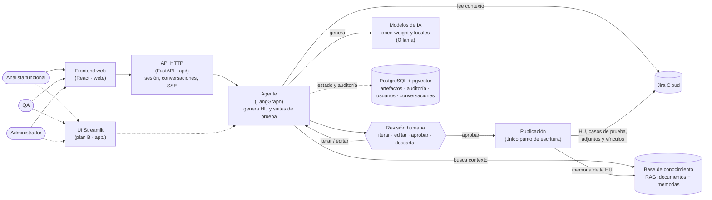

# Arquitectura · Agente de IA de AF y QA

Vista simplificada por componentes principales y actores (estado a 2026-10-02, tras la D-04 revisada). El detalle de contratos, nodos y tablas está en `docs/specs/SPEC-00-fundacional.md`, que es la fuente de verdad; el modelo C4 está en `docs/arquitectura-c4.md`.

- **Actores:** el analista funcional crea, evoluciona y revisa HU; QA genera las suites de prueba de una HU; el administrador gestiona conexiones, modelos y documentos.
- **Frontend y API:** el frontend en React (T-56) habla solo con la API HTTP (T-55); nunca con Jira ni con el LLM. La UI en Streamlit es el plan B hasta el punto de control T-57 y usa el núcleo directamente.
- **Agente:** reúne el contexto de Jira y del RAG, pide al modelo una salida estructurada y la valida antes de enseñarla.
- **Revisión humana:** nada llega a Jira sin aprobación explícita con la huella de la versión vista; la publicación es el único componente que escribe.
- **Memoria:** cada HU publicada genera un resumen que vuelve al RAG y mejora las siguientes generaciones.
