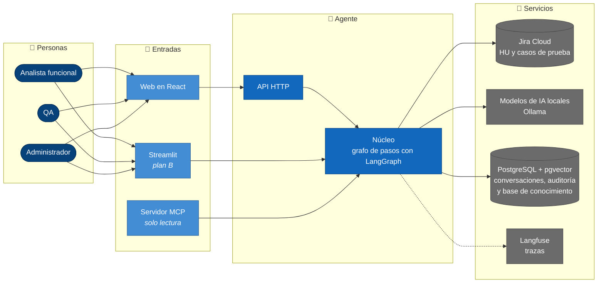
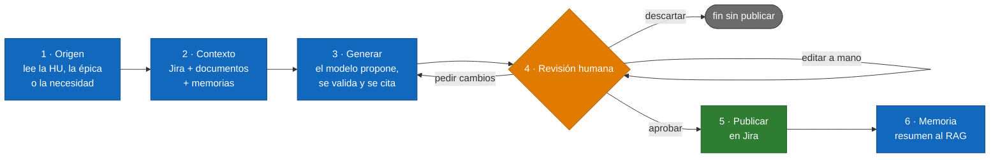
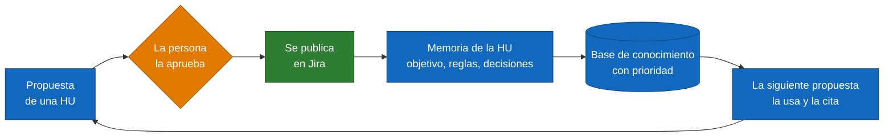

# Arquitectura · Agente de IA de AF y QA

Vista para explicar el sistema en pocos minutos (estado a 2026-10-05). El modelo C4, con más detalle, está en `docs/arquitectura-c4.md`; los contratos, en `docs/specs/SPEC-00-fundacional.md` (fuente de verdad).

**En una frase:** el agente redacta historias de usuario y casos de prueba con el contexto de Jira y de la documentación de la empresa; una persona revisa y aprueba, y solo entonces se publica en Jira. Lo publicado se convierte en memoria y mejora las siguientes propuestas.

## 1. El sistema de un vistazo

Cuatro capas, de izquierda a derecha: quién lo usa, por dónde entra, el agente y los servicios que usa.

- **Entradas:**
  - la web en React es la interfaz principal (T-56) y solo habla con la API;
  - Streamlit es el plan B y ya cubre los dos flujos completos;
  - el servidor MCP deja consultar el agente desde Claude Desktop, Claude Code o VS Code, sin poder escribir nada.
- **Agente:** el núcleo es un grafo de pasos. Reúne el contexto, pide al modelo una respuesta estructurada, la valida y espera a la persona.
- **Servicios:**
  - Jira es el origen y el destino;
  - los modelos son abiertos, gratuitos y locales;
  - PostgreSQL guarda el estado y, con pgvector, la base de conocimiento (RAG);
  - Langfuse recoge las trazas de cada operación.

## 2. Cómo trabaja el agente

El mismo recorrido sirve para una HU y para una suite de pruebas. En azul, lo que hace la IA; en naranja, lo que decide la persona; en verde, el único paso que escribe en Jira.

1. **Origen:** de qué se parte. Puede ser una necesidad en texto libre, una épica o una HU de Jira.
2. **Contexto:** lo que el agente sabe antes de escribir: la HU y sus vínculos en Jira, los documentos relevantes del RAG y las memorias de HU ya publicadas, que tienen prioridad. Todo cabe en un presupuesto de tokens.
3. **Generar:** el modelo devuelve una estructura fija (título, «Como / Quiero / Para», criterios de aceptación, reglas de negocio, citas a las fuentes), no texto libre. El agente comprueba los identificadores y las citas antes de enseñarla.
4. **Revisión humana:** la persona pide cambios, edita o descarta. Al aprobar se guarda una huella de exactamente lo que vio.
5. **Publicar:** solo con esa aprobación. Crea o actualiza la HU, los casos de prueba como subtareas, los adjuntos y los vínculos. Por defecto está en **simulación**: enseña lo que haría sin escribir nada.
6. **Memoria:** tras una publicación real, un resumen de la HU vuelve a la base de conocimiento.

Se puede **detener** una generación en curso y **reintentar** un paso que falló. Reintentar nunca repite una publicación.

## 3. El ciclo de aprendizaje

Cómo mejora el agente con el uso: no reentrena el modelo, sino que amplía su contexto con lo que las personas ya han validado.

Solo aprende de lo aprobado y publicado (D-07): lo que se queda en simulación o se descarta no entra en la memoria.

## 4. Qué hace cada rol

| Rol | Con el agente puede | El agente aporta |
|---|---|---|
| **Analista funcional** | Crear una HU desde una necesidad o una épica, evolucionar una HU existente, ver el impacto en otras HU y revisar la calidad (INVEST) | Un borrador con criterios y reglas citando sus fuentes, la comparación con la versión de Jira y las HU afectadas |
| **QA** | Generar la suite de una HU (también la que le pasa el analista) y registrar la ejecución de cada caso con su evidencia | Casos positivos, negativos y de límite trazados a cada criterio, y la matriz de trazabilidad |
| **Administrador** | Probar las conexiones y ver qué modelo atiende cada tarea | El estado de Jira, la base de datos y los modelos sin gastar tokens |

Los tres roles ven la pestaña **Memoria**, con lo que el agente ha aprendido.

## 5. Garantías

- **Nada se escribe en Jira sin aprobación.** Hay un único paso que escribe y exige la huella de lo aprobado. El servidor MCP y la simulación no escriben nunca.
- **Trazabilidad:** cada artefacto cita su origen (clave de Jira, criterios, reglas y casos), y cada decisión queda en la auditoría.
- **Datos y secretos:** datos sintéticos en todo el proyecto; los secretos se leen de un `.env` y nunca aparecen en el código, los logs ni las trazas.
- **Coste cero:** modelos abiertos y gratuitos ejecutados en local. Si un proveedor se satura, se pasa al siguiente de la cadena.
- **Observable:** cada operación deja una traza en Langfuse con sus pasos, tokens y tiempos. El texto completo solo se envía si se activa el interruptor.

## 6. Dónde corre

| Pieza | Dónde |
|---|---|
| PostgreSQL + pgvector y Ollama | Docker Compose en el equipo |
| API, Streamlit y servidor MCP | Procesos de Python en el mismo equipo (la API también tiene imagen de Docker) |
| Web en React | Servidor de desarrollo de Vite, que pasa `/api` a la API |
| Jira | Jira Cloud, proyecto de pruebas |
| Langfuse | Langfuse Cloud, plan gratuito |
