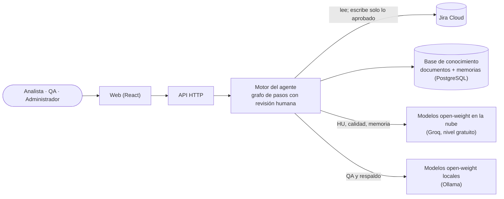

# Agente de IA de Análisis Funcional y QA · Dossier para dirección

*Estado a 8 de octubre de 2026 · MVP · todos los datos citan su fuente en el repositorio.*

## 1. Qué es y qué problema resuelve

**El problema:** redactar historias de usuario (HU) y diseñar sus pruebas cuesta horas de analistas y QA, la calidad varía según quién lo escriba y el conocimiento de proyectos anteriores se pierde.

**El agente:**
1. Propone HU y casos de prueba a partir de Jira y de la documentación funcional, y cita de dónde sale cada criterio.
2. Una persona revisa, pide cambios o edita, y aprueba: **nada se escribe en Jira sin esa aprobación**.
3. Cada HU publicada se resume en una memoria que el agente reutiliza en las siguientes propuestas: aprende de lo validado, sin reentrenar el modelo.

Fuentes: `CLAUDE.md`, `docs/arquitectura.md`.

## 2. Flujos principales

| Flujo | Rol | En una línea |
|---|---|---|
| **Nueva necesidad** | Analista funcional | De un texto libre a una HU con criterios Gherkin, reglas de negocio y fuentes citadas |
| **Evolucionar una HU** | Analista funcional | Versión nueva de una HU de Jira, con las diferencias frente a Jira y las HU afectadas |
| **Revisar la calidad** | Analista funcional | Informe INVEST con hallazgos y propuestas, sin tocar Jira |
| **Preparar pruebas** | QA | Suite de casos (positivos, negativos y de límite) trazados a cada criterio, publicada como subtareas de la HU con la estrategia y la matriz adjuntas |
| **Memoria** | Todos | Lo que el agente ha aprendido de las HU publicadas, que usa como fuente prioritaria |

Fuentes: `ONBOARDING.md` §1, `docs/specs/UI.md`, decisión D-09 (casos como subtareas en Jira).

## 3. Arquitectura

- **Web:** la interfaz principal; solo habla con la API. Streamlit queda como plan B.
- **Motor:** reúne el contexto (Jira, documentos y memorias), pide al modelo una respuesta con estructura fija, la valida y espera a la persona.
- **Modelos:** solo open-weight y gratuitos (D-14). El modelo se cambia por configuración, sin tocar código.
- **Otras entradas:** un servidor MCP permite consultar el agente desde asistentes de IA, solo en lectura.

Fuentes: `docs/arquitectura-c4.md` (niveles 1 y 2), `config/README.md`.

## 4. Garantías de control

| Garantía | Cómo se cumple | Fuente |
|---|---|---|
| **Aprobación humana con huella** | Un único paso escribe en Jira y exige la aprobación de la versión exacta revisada (huella SHA-256). Si el contenido cambia, la aprobación deja de valer, y una aprobación se usa una sola vez | `core/approvals.py`, `core/graph/nodes.py` |
| **Publicación simulada por defecto** | `JIRA_PUBLISH_MODE=simulation` muestra lo que se haría sin escribir nada. Solo el proyecto sintético AFQP se usa en modo real | `core/config.py`, `docs/demo/HU-AFQP.md` |
| **Auditoría** | Cada decisión (crear, iterar, editar, aprobar, publicar) queda registrada con persona, versión y claves de Jira | `core/audit.py`, tabla `audit_log` |
| **Revisión independiente** | La auditoría completa del código (2026-10-08) no encontró **ningún camino que escriba en Jira sin aprobación** | `docs/auditorias/AUDITORIA-2026-10-08.md` |
| **Datos sintéticos** | Corpus y Jira de una biblioteca ficticia (Villaficticia): 28 documentos y 13 HU; detección de datos personales en las suites y la memoria | `data/seed/`, `core/personal_data.py` |
| **Sin secretos** | Credenciales solo en un `.env` que no se versiona, leídas como `SecretStr`; `gitleaks` en cada commit | `core/config.py`, `.pre-commit-config.yaml` |
| **Accesibilidad** | Revisada con axe (WCAG 2.1 A/AA), manejo completo con teclado, a 1024–1440 px y al 100–150 % de escala | `web/HANDOFF.md` |

## 5. Decisiones y sus contrapartidas

| Decisión | A favor | En contra | Fuente |
|---|---|---|---|
| **Modelos open-weight y gratuitos** (D-14), primero solo locales | Coste cero, privacidad total, sin dependencia de un proveedor | En CPU, minutos por operación, y un modelo pequeño (1,7 B) con calidad baja | `docs/decisiones/01_declaraciones_proyecto.md`, `COMPARATIVA-MODELOS.md` |
| **Configuración mixta** (PA-443, 2026-10-08) | HU y calidad en segundos con Groq; QA en local; respaldo local en todo | Con Groq la HU sale del equipo (solo con datos sintéticos), y su nivel gratuito limita el volumen por minuto | `config/README.md` |
| **Web propia en React** frente a Streamlit (D-04 revisada, T-57) | Diseño de marca, accesibilidad y experiencia de producto | Más código que mantener; Streamlit se conserva como plan B | `docs/KANBAN.md`, `web/README.md` |
| **Alcance del MVP** | Los cuatro flujos completos con publicación real validada | Queda fuera lo del §7 | `web/DEMO.md` §6 |

## 6. Métricas

| Métrica | Valor | Fuente |
|---|---|---|
| **Calidad del RAG** | Recall@6 **0,90**; MRR 0,72 (las memorias de HU publicadas pasan delante por diseño); latencia media 0,3 s | `docs/pruebas/rag-eval-2026-10-08.md` |
| **Pruebas automáticas** | **7492** de backend (Python) y **2627** de la web, en verde | `uv run pytest -m "not integration"` y `npm test` (2026-10-08) |
| **Tiempo de una HU nueva** | **~4–5 min** con el modelo local en CPU → **11 s** con Groq | `docs/pruebas/medidas-groq-vs-local-2026-10-07.md` |
| **Tiempo de una suite de QA** | **~8 min** en local → **41 s** con Groq | ídem |
| **Revisión de calidad** | **~7 min** en local → **7,7 s** con Groq | ídem |
| **Prueba contra Jira real** | 2 HU publicadas con aprobación (AFQP-27 y AFQP-28) y una suite de 6 casos como subtareas (AFQP-29 a AFQP-34); sus memorias, indexadas y reutilizadas como fuente | `docs/demo/HU-AFQP.md` |
| **Coste de modelo** | **0 €** hoy; con un modelo comercial, estimados **~0,03 $ por suite** y **~30 $ / 1000 operaciones** (Sonnet 5.5) | `COMPARATIVA-MODELOS.md` §5 |

## 7. Qué queda fuera y próximos pasos

**Fuera de esta entrega:**
- el flujo unido «HU → pedir sus pruebas a QA» en la web;
- el historial y el registro de auditoría en pantalla;
- editar a mano la suite de QA;
- elegir el modelo por petición;
- gestionar documentos y usuarios desde la web.

Fuente: `web/DEMO.md` §6.

**Auditoría del 2026-10-08, corregida el mismo día:** el hallazgo alto (una segunda suite de la misma HU se daba por publicada sin llegar a Jira) y los 11 medios se corrigieron y verificaron en cuatro líneas de trabajo en paralelo (PA-450 a PA-461), junto con la revisión de calidad con propuestas de reglas nuevas (PA-467). Quedan propuestas menores para después de la demo. Fuente: `docs/KANBAN.md`.

**Próximos pasos propuestos:**
1. **Piloto de 4 semanas** con un equipo real, en simulación y con aprobación humana, midiendo horas por HU y por suite antes y después.
2. **Decidir dónde corre el modelo** para producción: GPU propia, Groq de pago o un modelo comercial con acuerdo de datos (`COMPARATIVA-MODELOS.md` §7).
3. **Ampliar la evaluación del RAG** a las 7 categorías y a las memorias (PA-70).

## 8. Datos que faltan para el coste-beneficio

El repositorio no contiene estos datos; los necesitamos para un caso de negocio sin suposiciones:

| Dato | Quién puede aportarlo |
|---|---|
| Horas que dedica hoy un analista a una HU y QA a su suite | Equipos de AF y QA |
| Volumen mensual de HU y de suites | Responsables de proyecto |
| Coste por hora de analista y de QA | Finanzas / RR. HH. |
| Retrabajo y defectos atribuibles a requisitos mal escritos | QA / calidad |
| Tasa de aceptación de las propuestas del agente con datos reales (cuánto se edita) | El piloto |
| Coste de la opción de despliegue elegida (GPU, Groq de pago o modelo comercial) | Sistemas |
| Política de la empresa sobre enviar requisitos a un proveedor en la nube | Seguridad / legal |
| Coste de operar el agente (mantenimiento, soporte, actualizaciones de modelo) | Sistemas |
